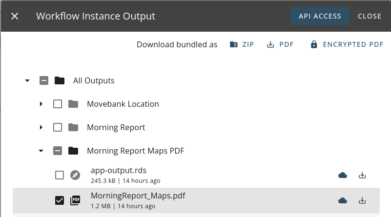
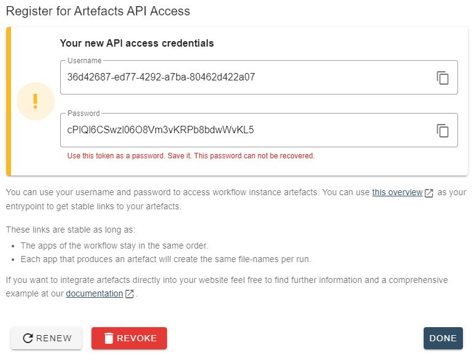
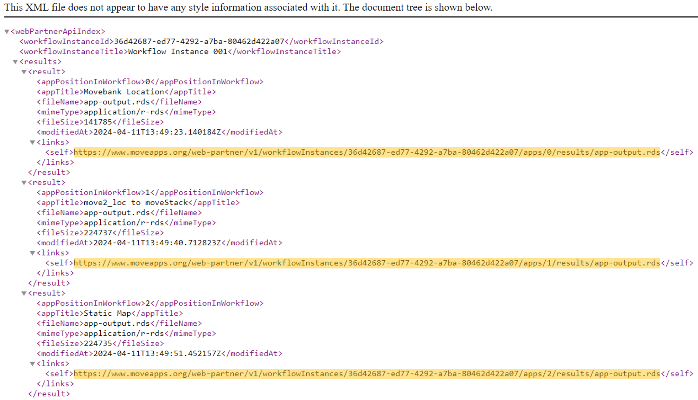

# Access Workflow products via API link

## Create API links

Each output product of a Workflow can be remotely addressed and downloaded via a secured, stable https link that can be created by our API functionality. This can be done for scheduled as well as manually run Workflows. The link always accesses the most up-to-date product/artifact (See *"Behavior during Workflow runs or when these fail"* bellow). To create such a stable https link, please click the `API Access` button at the top of the `Output` window. This directs you to a site to "Register for Artefacts API Access". Here, you need to `Register`, which creates a user name and password that can be used to access the https links for this Workflow Instance (only). Please store these details somewhere for later use. 

<kbd></kbd>

<kbd></kbd>
 
To access the overview of the product/artifact https links, go to the `Output` window, `API Access`, and then to `this overview`. You then have to enter the previously created user name and password. An XML list will be shown that provides the links (highlighted in the screenshot below). Note that these links are defined by the position of the App in the Workflow and the name of the product file. Thus, the link is stable only if the Apps in the Workflow stay in the same order and the products of the Apps keep the same name. Each time the Workflow is now run, the product changes and is accessible via the stable link. So, it is possible to integrate the secure link into a webpage, and the file can be automatically updated each time the Workflow has run.

<kbd></kbd>

## Integrate API links into your website

Please have a look at our [example page](https://docs.moveapps.org/web-partner-api/example.html). We have integrated multiple artifacts from a Workflow running on MoveApps. The details of how we integrated it into the site can be used as an example for you to follow. See the code of this example page on our [github repository](https://github.com/movestore/movestore.github.io/blob/master/web-partner-api/example.html).

## Behavior during Workflow runs or when these fail

We want to guarantee a smooth update of the files embedded in a website via API link.
- The files obtained in the previous run are kept and made available via API until they get replaced by the newly calculated ones:
    - during the time the Workflow is re-running (scheduled or manually triggered)
    - when the settings of an App are modified
    - when the Workflow run fails
- The files accessed via API link from the previous run will not be available anymore if:
    - an App is removed or added to the Workflow. This changes the position of the Apps and the API links are redefined.


## Access App outputs in R via API link

You can access any output of any App of an Workflow via the API link in R. Here an example code:

```r
library(move2)
library(httr)

# Credentials from the example page
username <- '8b536ed8-a681-4786-aa01-b26040106f9f'
token <- 'bdl@2nq@9SD!i31a1M7HxG7GQG93IQ0a'

# Insert username into URL
url <- sprintf("https://www.moveapps.org/web-partner/v1/workflowInstances/%s/artifacts/index", username)

# Send GET request
req <- GET(url = url, authenticate(username, token))

# extract content from request
cont <- content(req, as = "parsed", simplifyDataFrame = TRUE)

# to explore what output is available, explore the cont object
str(cont)

# Access/Download first file
tmp <- tempfile()
w1 <- GET(cont$results$links$self[1], authenticate(username, token), write_disk(tmp))

# Read downloaded file
movedat <- readRDS(tmp)

# Plot
plot(movedat)
```


