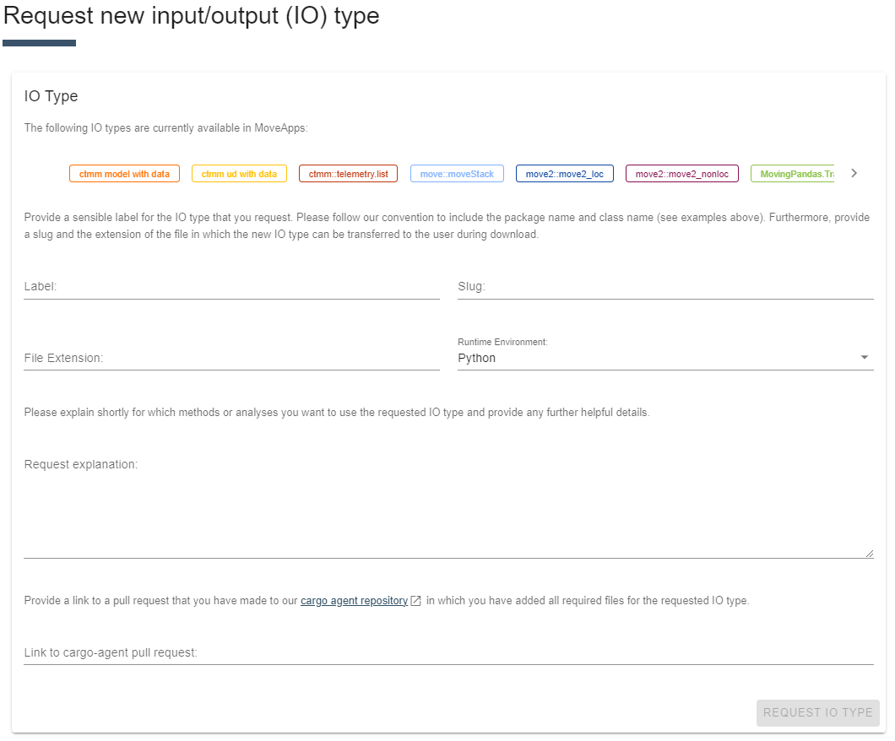
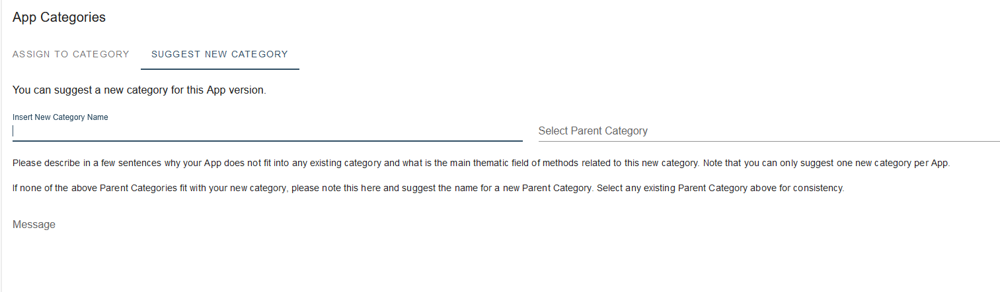

# Input and Output types
The Apps on MoveApps are based on different programming languages (currently R and Python), and each App uses functions that require a specific data input type and provide a specific data output type. Thus, each App is characterised by those two input/output (IO) types. Apps can only be added in sequence into a Workflow if the output type of the previous App matches the input type of the next App. Some IO types can be translated into each other using [Translator Apps](translator.md) and Apps of those types can therefore be used in the same Workflow. 

When submitting an App to MoveApps, the runtime environment (R or Python) needs to be indicated, as well as the input and output types of your App. Note that the IO types and runtime environment will be fixed to the App and cannot be changed afterwards.

The following IO types are currently available in MoveApps

#### IO types for R
- [ctmm model with data](https://github.com/movestore/cargo-agent-r/blob/main/src/analyzer/ctmm_model_with_data/README.md ':ignore')
- [ctmm ud with data](https://github.com/movestore/cargo-agent-r/blob/main/src/analyzer/ctmm_ud_with_data/README.md ':ignore')
- [ctmm::telemetry.list](https://github.com/movestore/cargo-agent-r/blob/main/src/analyzer/ctmm_telemetry_list/README.md ':ignore')
- [move::moveStack](https://github.com/movestore/cargo-agent-r/blob/main/src/analyzer/move_move_stack/README.md ':ignore')
- [move2::move2_loc](https://github.com/movestore/cargo-agent-r/blob/main/src/analyzer/move2_move2_loc/README.md ':ignore')
- [move2::move2_nonloc](https://github.com/movestore/cargo-agent-r/blob/main/src/analyzer/move2_move2_nonloc/README.md ':ignore')

#### IO types for Python
- [MovingPandas.TrajectoryCollection](https://github.com/movestore/cargo-agent-python/blob/main/src/analyzer/moving_pandas_trajectory_collection/README.md ':ignore')

## Requesting a new IO type
To extend the functionality of MoveApps, it is possible to request new IO types. If you need a new IO type for your App, please [request a new IO type](https://www.moveapps.org/apps/io-type/request). In the form, please describe your request to us, provide a label and adapt our [R](https://github.com/movestore/cargo-agent-r) or [Python](https://github.com/movestore/cargo-agent-python) cargo agent repository accordingly. In the form, you will also need to provide a link to a pull request of the adapted cargo agent (this option is available in the form after selecting the Runtime Environment). Your IO type request will now be reviewed by a system administrator. Once an administrator has approved your IO type request, it will be available on the MoveApps platform. Make sure to also provide [Translator Apps](translator.md) to/from other IO types to widen the usability of your App on MoveApps.

!\> Details on how to request a new IO type and how to adapt the cargo agent be found in the README of the [R](https://github.com/movestore/cargo-agent-r/blob/main/README.md) and [Python](https://github.com/movestore/cargo-agent-python/blob/main/README.md) cargo agents.

<kbd></kbd>

# App Categories
When submitting an App, you will be asked to assign one or more Categories to your App. Assigning appropriate Categories to your App ensures that it can easily be found by other users. In the App Browser, Apps can be filered by their Category, among others. Examples of currently available App Categories are 'Data Access', 'Data Visualisation', 'Segmentation', and 'Translator'. Check out the [App Browser](https://www.moveapps.org/apps/browser) for a list of all available App Categories.

If your App does not fit into any of the existing Categories, you can request an additional Category in the interface when submitting an App. You will also need to describe why your App does not fit into any existing Category. Your Category request will be reviewed by a system administrator. Once an administrator has approved your request, it will be available on the MoveApps platform.

*It will soon be possible to request a new Category before starting the App submission.*

<kbd></kbd>