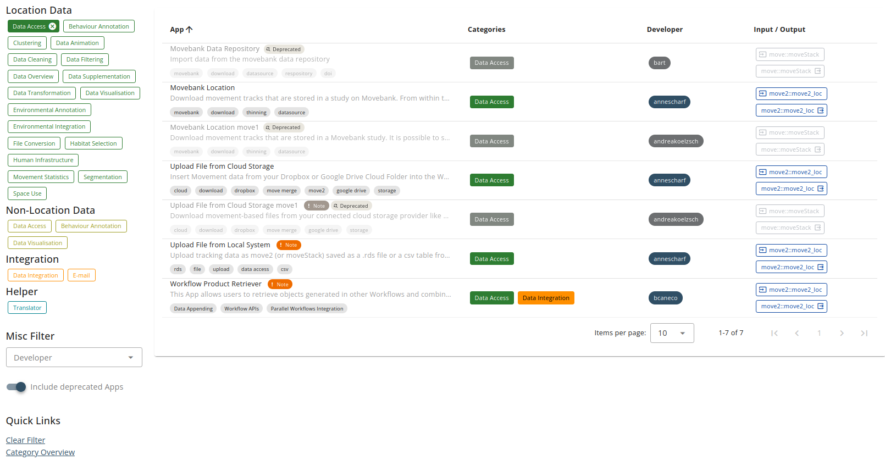

# App deprecation

An App that has been replaced by an improved, different App or that cannot be maintained any more, can be deprecated by the App developer. That means that the App cannot be added any more to new Workflows, but still runs in already existing Workflows.

## Deprecation by the App developer

To deprecate an App, the App developer must go to the App management site under `My Apps`. At the top, to the left of the buttons `Add Version` and `Edit Details`, you see the yellow button `Deprecate App`. Clicking it, the deprecation dialog opens and promts (i) to provide a small message that will be shown in the App details to any user of the App and (ii) to select one of the available Apps that can be advised to the user as replacement. Beware that App deprecation is permanent and that Apps cannot be reactivated.

<kbd></kbd> \
<kbd></kbd>

## Appearance of deprecated Apps

For quick recognition, deprecated Apps are marked with a yellow `Deprecated` label in any appearance on the platform. In the App details, a prominent a message appears in yellow that also includes the App developer's note and suggestion for replacement. 

<kbd></kbd>
<kbd></kbd>

 The deprecated Apps appears in the App browser list upon request; see the slider down below the App browser page. In the My Apps overview of the App developer, the deprecated Apps are included, but can be excluded, also by a slider down below the list.

<kbd></kbd>

## Public Workflows with deprecated Apps

Public Workflows that contain at least one deprecated App are marked as `deprecated` in the list. That does NOT mean that they are non-functional. They can still be copied/added to your Dashboard and executed. This is the only way that deprecated Apps can be used anew, which we must provide for reproducibility reasons. Most deprecated Apps will still be running as expected, but if they interact with outside ressources (e.g. Movebank), functionality cannot be guaranteed. Therefore, for new, independent analyses we recommend to replace the deprecated Apps in the Workflow. Note that such replacement might not be easily possible due to App compatibility problems if Input/Output types of Apps differ. Consider the usage of [Translator Apps](translator.md) or build a new Workflow from scratch.

<kbd></kbd>

