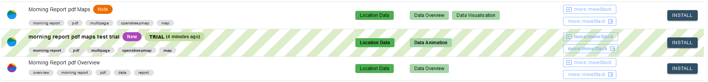
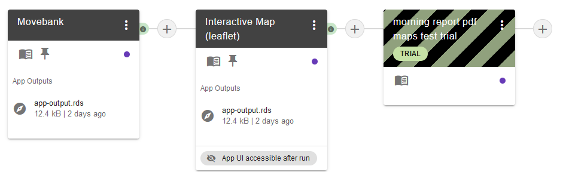
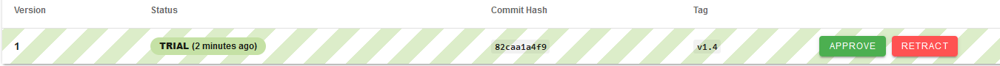
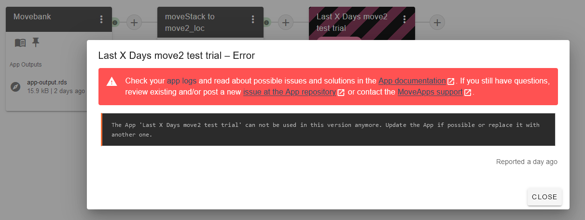

# How to create an R or R-Shiny App

Here you find a step-by-step guide on creating a MoveApps R App. **Please carefully follow the steps below to create an App.**

All Apps to be submitted must be managed in a public [GitHub](https://github.com ':ignore') repository. When creating R Apps, the repository should contain the program code for executing the App (in a file named `RFunction.R` for R-Apps or `ShinyModule.R` for R-Shiny Apps), a specification of the App represented by an [`appspec.json`](appspec.md) file and a documentation file (called `README.md`), which needs to be the repository README.

For R and R-Shiny Apps we provide templates containing Software Development Kits (SDK) with an RStudio Project that allows Apps to run and perform as if in the MoveApps interface. We encourage you to use one of these GitHub templates: [Template R Function App](https://github.com/movestore/Template_R_Function_App ':ignore'), [Template R Shiny App](https://github.com/movestore/Template_R_Shiny_App ':ignore'), [Template R Shinydashboard App](https://github.com/movestore/Template_R_Shinydashboard_App ':ignore') . Please read the `developer_README.md` contained in each template for more information about the usage and the optional tools provided with it. The GitHub templates include all necessary files and example data for testing your App. We recommend using RStudio for local development of the App.

The following image contains an overview of the files in each of the templates and whether they need to be adapted or not.
  

This description is applicable only for R and R-Shiny Apps, see our [Python Tutorial](create_py_app.md) for instructions on how to create a Python App.

#### Notes and recommendations
- As the R packages `move` and `sp` will be deprecated, consider working with `sf` and using the brand-new [`move2` package](https://bartk.gitlab.io/move2/index.html ':ignore'), which has recently been added to CRAN. Generally, avoid any use of deprecated R packages.

- Stepwise App review is now implemented! The new trial stage allows you to test your App in MoveApps before it will become available to all users.

- Don’t be afraid to hand in a preliminary App, you can add a warning message that can be seen by all users.

- Make sure that users of your App are enabled to understand what is required of input data, what happens in the App and how the method works, so that they can interpret the results correctly and understand possible issues.

## Steps to create an App

### Step 1: Use a template to initialise an App repository
Login to GitHub and go to either the [Template R Function App](https://github.com/movestore/Template_R_Function_App ':ignore'), [Template R Shiny App](https://github.com/movestore/Template_R_Shiny_App ':ignore') or [Template R Shinydashboard App](https://github.com/movestore/Template_R_Shinydashboard_App ':ignore'). Click on `Use this template` to copy the template to a new repository within your GitHub account. Name this repository as your App will be named in MoveApps, please adhere to our convention of Title Case (e.g. My New App). Clone this repository to your local system (see [Manage your MoveApps Apps with GitHub and RStudio](manage_Rapp_github.md) for instructions on how to do this) or download the template as a .zip file via `Code > Download ZIP`.

### Step 2: Ensure that our template runs properly on your system
The template includes a file `sdk.R` which can be used for testing the `RFunction.R` file. When running the `sdk.R` file in the RStudio project it emulates how MoveApps would behave when running your App (i.e. the `RFunction.R`).

Execute `Rscript sdk.R` in a terminal or run `sdk.R` interactively in RStudio to ensure that our template runs properly on your system. Make sure that the SDK executes the vanilla template App code (i.e. without alterations and without locading additional packages). Everything is set up correctly if no error occurs and you see something like *Welcome to the MoveApps R SDK*.

<kbd></kbd>

More information on the files in the templates and their functions can be found in the `developer_README.md` in the templates: [R Function App](https://github.com/movestore/Template_R_Function_App/blob/master/developer_README.md ':ignore'), [R Shiny App](https://github.com/movestore/Template_R_Shiny_App/blob/master/developer_README.md ':ignore'), [R Shinydashboard App](https://github.com/movestore/Template_R_Shinydashboard_App/blob/master/developer_README.md ':ignore').

### Step 3: Develop the App code locally within the template
MoveApps Apps can be developed in your usual compiler/editor (e.g. RStudio). The App R code has to be saved in one file either named `RFunction.R` or `ShinyModule.R`. This file is the entrypoint for your App logic.  We provide instructions on [writing `R Function` App code](copilot-r-sdk.md) and on [writing `Shiny Module` App code](copilot-shiny-sdk.md), including information on input files and parameters.

<kbd></kbd>

!\> The file must be named `RFunction.R` or `ShinyModule.R`, do not alter it.

### Step 4: Test your App locally
MoveApps Apps should be thoroughly tested locally before submission to MoveApps. All Apps must be tested using all provided data sets in the folder `./data/raw/`. To test the App locally, use the file `sdk.R` in combination with `.env` and `app-configuration.json` which emulate running behaviour (almost) like on the online MoveApps system. Have a look at [this compilation of edge case data sets](https://github.com/movestore/Movebank_Example_Datasets ':ignore') for more intensive testing and development.

The two files emulating MoveApps interactive behaviour locally are `.env` (this file is hidden by default), which defines the input and output files path (please only adapt the source file path here), and `app-configuration.json`, which allows you to adapt the App settings for local testing. Note that the json format is required here. The fourth included file that you must use for development is the `RFunction.R`. This is the file into which all your App code is supposed to go and the only R file that is actually integrated into MoveApps when your App is built.

In addition, we require unit tests for `RFunction` Apps using `testthat`. Follow the example in the folder [`./tests/testthat/`](https://github.com/movestore/Template_R_Function_App/tree/master/tests/testthat ':ignore') and adapt the file `./tests/testthat/test_RFunction.R` to work with your App code.

### Step 5: Write App specifications
App specifications should be written into the file `appspec.json` to define the App's metadata and the user interface to specify MoveApps App parameters (see [App specifications](appspec.md)). You can test this file for compliance in the [Settings editor](https://www.moveapps.org/apps/settingseditor ':ignore').

### Step 6: Write a documentation file
Write about the detailed function and use of the App including possible error cases. We recommend using the `README.md` that is provided as a template in each of the App templates: [R Function App](https://github.com/movestore/Template_R_Function_App/blob/master/README.md ':ignore'), [R Shiny App](https://github.com/movestore/Template_R_Shiny_App/blob/master/README.md ':ignore'), [R Shinydashboard App](https://github.com/movestore/Template_R_Shinydashboard_App/blob/master/README.md ':ignore').

### Step 7: Upload all changes to your GitHub repository
After developing the App code and updating all required files, upload/push all changes to your App's GitHub repository. The following three files are mandatory for running on MoveApps: `appspec.json`, `RFunction.R` (for R Apps) or `ShinyModule.R` (for R-Shiny Apps) and a documentation file (needs to be`README.md`). Additional files can be included (see image above), but are not required.

### Step 8: Create a Tag/Release
Create a Tag in your project's GitHub repository by clicking on `Create a new release`. Note: if you have already created a release before, click on `Releases > Draft a new release`.

<kbd></kbd>

Choose a tag (version name, e.g. v0.1) and choose a release title (e.g. first version). You can choose to add a description ot this release, or to attach files (see [auxiliary files](auxiliary.md#adding-large-fixed-or-fallback-files-to-an-app) for a case where this may be desired). Then, click on `Publish release`.

<kbd></kbd>

### Step 9: Initialize the App on MoveApps
After you have successfully written a functioning App, copied it or used the template (together with the [appspec.json](appspec.md)) into your GitHub App repository and described its details in the `README.md` file, you can initiate it on MoveApps. To do this, select `My Apps > Create new app` from the menu in your Dashboard, or click on `Initialize a New App` in your `App Overview` and fill out the form. 

<kbd></kbd>

For the **App Title**/name please stick to our convention of Title Case without hyphens (e.g. `My New App`). The **description** should be identical with the short description in your documentation README. You can add a **Warning Note** that will be highlighted to any MoveApps user adding your App to a Workflow. Note that the Title, Description and Warning note can be edited at any time.

<kbd></kbd>

The link to your repository (**Repository URL**) has to end with `.git`; please add it manually if necessary (example: `https://github.com/movestore/MorningReport.git`). 

<kbd></kbd>

Each App is defined by a **Runtime Environment** and an **Input Type** and **Output Type** (IO types) that have to be specified. Possible environments are R, R-Shiny and Python. Input and output types have long been restricted to `move::moveStack`, but can now be extended to any other movement related data types. Due to deprecation of the `move` package we discourage use of `move::moveStack` for any new Apps. Please use `move2::move2_loc` instead.

After selecting R or R-Shiny as your Runtime Environment, check which IO types are available in the dropdown list. If you need a new IO type for your App, please check out the instructions on how to [request a new IO type](IO_types.md).

<kbd></kbd>

Once you have filled the form, click on `Initialize App`. When you have successfully created the App, it will be listed in the overview `My Apps > App Overview`

!\> Note that the repository link, IO types and runtime environment will be fixed to the App and cannot be changed afterwards. 

### Step 10: Submit a first App version
After initializing the App in MoveApps, you can to submit a first (or later updated) App version to MoveApps. In order to create your first (or any updated new) App version, you must create a `Tag` (via `Release`) of your GitHub repository in its present state (see Step 8). After you have created the `Tag`, go to the MoveApps site and press the `Add Version` button in the detailed view of your App (via `My Apps > App Overview > AppName`). Select the `Tag` from the list of available `Tags` and press `Create Version`. A new App version is only available if your tag creation in GitHub was successful. 

<kbd></kbd>

To submit the new version, you must include a description detailing the changes and select/update a Category that fits your App. If you want to request an additional Category, please suggest it in the interface (see our instructions on how to [request a new App Category](IO_types.md)). In the bottom panel of this page, you can check, among others, the settings of your App, and the people that were specified in the `appspec.json` file. After entering and checking all information, click `Save and Submit`.

<kbd></kbd>

One of the MoveApps administrators will check the App for functionality, performant `appspec.json` and possible issues regarding our Terms of Use. Then, the App will be build into a docker container for intergration into the platform. If the App has built successfully, it will acquire private trial status. You will receive an e-mail.

### Step 11: Test a private trial version on MoveApps
Upon successful review and built, your App version will enter the `TRIAL` stage and you will receive an E-mail from the system, possibly with comments from the administator. In case your App does not pass the review or the building process was unsuccessful, the administrator will reject your App version and you will get an E-mail with details about it. Please address any raised concerns and submit a new App version then.

Once your App is in status `TRIAL`, it becomes possible for only you (and the system administrators) to add this App to a Workflow in your MoveApps account. It appears in the list of Apps possible to add to your Workflow (with fitting IO type) in `TRIAL` design (see figure below). Also when included in a Workflow, the App will be highlighted with colour as a `TRIAL` App.

<kbd></kbd>
<kbd></kbd>

Please, [create some Workflows](create_workflow.md) and test if the App version is working as you expect within the MoveApps platform. Test your App for different data sets and parameter settings, use e.g. the wealth of open data sets on Movebank. Have a look at [this compilation of edge case data sets](https://github.com/movestore/Movebank_Example_Datasets ':ignore') for more intensive testing and development.

### Step 12: Approve (or retract) your App version
If the App is performing well, please select `APPROVE` in the respective App version of the App in your App Overview (`My Apps > App Overview > *your_app_name*`). The App version will aquire the status `APPROVED`and become visible and usable for all registered MoveApps users. In case the App version does not perform as expected, please `RETRACT` it from the system, adapt your code and submit a new version. In the Workflow where the `TRIAL` App has been included, it will be marked as `Retracted` and give an error if executed.

<kbd></kbd>
<kbd></kbd>

Thank you for submitting an App to the MoveApps platform!