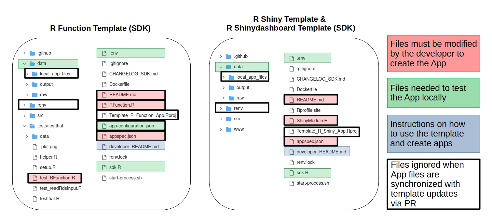
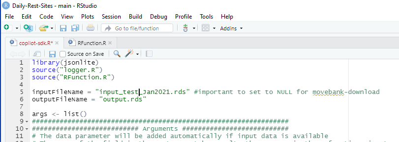
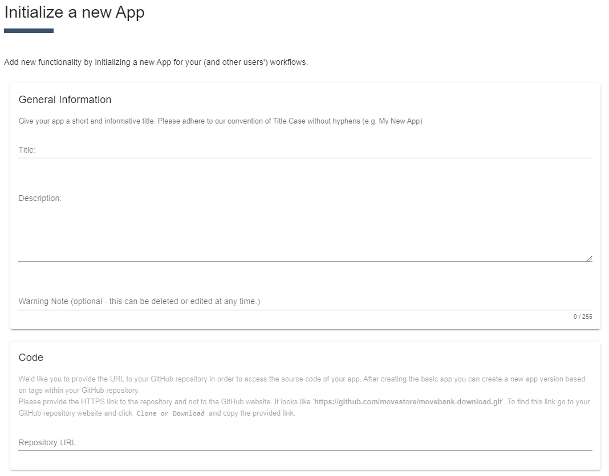
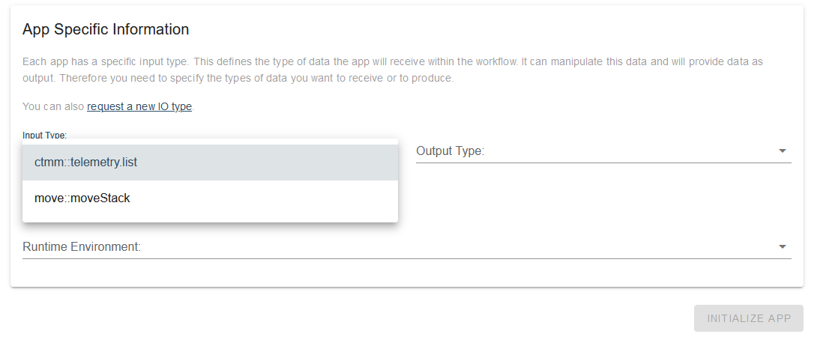
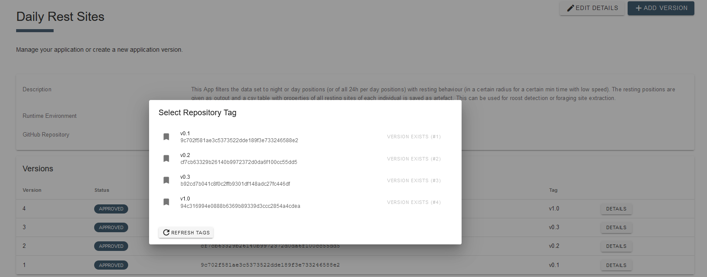

# How to create an R or RShiny App

All Apps to be submitted must be managed in a public [GitHub](https://github.com) repository. When creating R-Apps, the repository should contain the program code for executing the App (named `RFunction.R` for R-Apps or `ShinyModule.R` for R-Shiny-Apps), a specification of the App represented by an [appspec.json](appspec.md) file and a [documentation file](README_file_description.md), which needs to be the repository README. 

We encourage you to use one of these GitHub templates: [Template R Function App](https://github.com/movestore/Template_R_Function_App ':ignore'), [Template R Shiny App](https://github.com/movestore/Template_R_Shiny_App ':ignore'), [Template R Shinydashboard App](https://github.com/movestore/Template_R_Shinydashboard_App ':ignore') . Please read the `developer_README.md` contained in each template for more information about the usage and the optional tools provided with it.

This description is applicable only for R and Rshiny Apps, see our [Python Tutorial](create_py_app.md) for the recently integrated alternative.
  
<kbd></kbd>

## Steps to create an App

1. **Use a template to initialise an App repository** Login to GitHub and go to either the [Template R Function App](https://github.com/movestore/Template_R_Function_App ':ignore'), [Template R Shiny App](https://github.com/movestore/Template_R_Shiny_App ':ignore') or [Template R Shinydashboard App](https://github.com/movestore/Template_R_Shinydashboard_App ':ignore'). Click on `Use this template` to copy the template to a new repository within your GitHub account. Clone this repository to your local system (see [Manage your MoveApps Apps with GitHub and RStudio](manage_app_github) for instructions on how to do this).

1. **Develop the App code within the template** locally (in RStudio) and by adapting the file `RFunction.R` or `ShinyModule.R`. *details below*

2. **Test your App** locally using the file `sdk.R` in combination with `.env` and `app.configuration.json` which emulate running behaviour (almost) like on the online MoveApps system. Note that before submission to MoveApps, all Apps must be thoroughly tested locally to run for all provided data sets in the folder `./data/raw/`. Furthermore, we require unit tests using `testthat`. Follow the example in the folder `./tests/testthat/` and adapt the file `./tests/testthat/test_RFunction.R` to work with your App code.

3. **Write App specifications** into the file `appspec.json` to define the App's metadata and the user interface for MoveApps users to specify App parameters (see [App specifications](appspec.md)). Test this file for compliance in the [Settings editor](https://www.moveapps.org/apps/settingseditor ':ignore').

4. **Write a documentation file** about the detailed function and use of the App including possible error cases. We recommend using the `README.md`, which is provided as a template in each of the App templates.

5. **Upload all changes to your GitHub repository** where the following three files are mandatory for running on MoveApps: `appspec.json`, `RFunction.R` (for R-files) or `ShinyModule.R` (for R-Shiny-Apps) and a documentation file (needs to be`README.md`). Additional files can be included (see image above), but are not required.

6. **Create a Tag** in your project's GitHub repository by clicking on `Create a new release`.

7. **Initiate the App** on MoveApps (`My Apps > Create new App`). *details below*

8. **Submit a first App version** to MoveApps (`Add version`). One of the MoveApps administrators will check the App and build it into a Docker container for integration to the platform. If the App has built successfully, it will acquire private trial status. You will receive an e-mail. *details below*

9. **Test a private trial version** of your App on MoveApps. Build a Workflow and test if your App version behaves as expected on the system. *details below*

10. **Approve (or retract) your App version** for visibility to all MoveApps users. If it needs adaptions, please retract and submit a new App version. *details below*

## Notes and recommendations
- As the R packages move and sp will be deprecated at the end of 2023, consider working with sf and using the brand-new [move2 package](https://bartk.gitlab.io/move2/index.html), which has recently been added to CRAN. Avoid any use of deprecated R packages.

- **Stepwise App review is now implemented!** The new trial stage allows you to test your App in MoveApps before it will become available to all users.

- Don’t be afraid to hand in a preliminary App, you can add a warning message that can be seen by all users.

- Make sure that users of your App are enabled to understand what is required of input data, what happens in the App and how the method works, that they can interpret the results correctly and understand possible issues.

## Develop the App code
MoveApps Apps should be developed in your usual compiler/editor and thoroughly tested before submission to MoveApps. For R and R-Shiny Apps we provide Software Development Kits (SDK) with an R Studio Project that allows Apps to run and perform as if in the MoveApps interface. The GitHub templates [Template R Function App](https://github.com/movestore/Template_R_Function_App ':ignore'), [Template R Shiny App](https://github.com/movestore/Template_R_Shiny_App ':ignore') & [Template R Shinydashboard App](https://github.com/movestore/Template_R_Shinydashboard_App ':ignore'), include all necessary files and example data for testing your app. These templates can either be used as a template to create a repository on your GitHub account (see [Manage your MoveApps Apps with GitHub and RStudio](manage_app_github)), or can be downloaded as a .zip file via `Code > Download ZIP`. 

The App R code has to be saved in one file either named `RFunction.R` ([R-App](copilot-r-sdk.md)) or `ShinyModule.R` ([R-Shiny-App](copilot-shiny-sdk.md)) and will be accessed by `sdk.R` in combination with `.env` (defining the input/output paths) and `app-configuration.json` (defining the App settings) during your developing and tests. Please keep the number of packages (libraries) as low as possible (*advice*: use `list.functions.in.file("RFunction.R")` from R package `NCmisc` to check which libraries are used by your code).

Note that currently the most widely used input and output (IO) object type is `move2::move2_loc` in `rds` file format. You can use the example data sets in `./data/raw/` in the GitHub templates. Non-location example data sets will soon be added.

The files in the folder `src` are included in the SDKs for communication functionality functions in MoveApps. In these files, functions are defined that can be used by the App developer to give information messages, warnings, errors, etc. to the user in MoveApps. Please use these functions in your Apps. Note that due to the (end 2023) deprecation of the `sp` package, on which the `move` package strongly depends, we recommend to use  the`sf` and `move2` packages for App development. There are the `move2::move2_loc` and `move2::move2_nonloc` IO types available and new ones can be requested (see below).

<kbd></kbd>

## Initiate the App
After you have successfully written a functioning App, copied it or used the template (together with the [appspec.json](appspec.md)) into your GitHub App repository and described its details in the `README.md` file, you can initiate it on MoveApps.

To do this, select `My Apps > Create new app` from the menu and fill out the form. For the App name please stick to our convention of Title Case without hyphens (e.g. `My New App`). The description should be identical with the short description in your documentation README. You can add a Warning Note that will be highlighted to any MoveApps user adding your App to a Workflow. Note that the Title, Description and Warning note can be edited at any time.

The link to your repository has to end with `.git`; please add it manually if necessary (example: `https://github.com/movestore/MorningReport.git`). 
Each App is defined by an input and output type (IO types) and runtime environment that have to be specified. Possible environments are R, R-shiny and Python. 

<kbd>
</kbd>

### IO types
Input and output types have long been restricted to `move::moveStack`, but can now be extended to any other movement related data types. Due to deprecation of the `move` package we discourage use of `move::moveStack` for any new Apps. Please use `move2::move2_loc` instead.

After selecting R or R-Shiny as your Runtime Environment, check which IO types are available in the dropdown list. If you need a new IO type for your App, please check out the instructions on how to [request a new IO type](IO_types.md).

Note that the repository link, IO types and runtime environment will be fixed to the App and cannot be changed afterwards. When you have successfully created the App, it will be listed in the overview `My Apps > App Overview`

## Submit a first App version
In order to create your first (or any updated new) App version, you must create a `Tag` (via `Release`) of your GitHub repository in its present state. After you have created the `Tag`, go to the MoveApps site and press the `Add Version` button in the detailed view of your App (via `My Apps > App Overview > AppName > Details`). Select the `Tag` from the list of available `Tags` and press `Create Version`. A new App version is only available if your tag creation in GitHub was successful. To submit the new version, you must include a description detailing the changes and select/update a Category that fits your App. If you want to request an additional Category, please suggest it in the interface. After entering all information, click `Save and Submit`.

<kbd></kbd>

The App is then checked by a MoveApps administrator for functionality, performant `appspec.json` and possible issues regarding our Terms of Use and a docker container for the App is initiated for built into a Docker container for intergration into the ssytem. Upon successful review and built, your App version will enter the `TRIAL` stage and you will receive an E-mail from the system, possibly with comments from the administator. In case your App does not pass the review or the building process was unsuccessful, the administrator will reject your App version and you will get an E-mail with details about it. Please address any raised concerns and submit a new App version then.

## Test a private trial version of your App
Once your App is in status `TRIAL`, it becomes possible for only you (and the system administrators) to add this App to a Workflow in your MoveApps account. It appears in the list of Apps possible to add to your Workflow (with fitting IO type) in `TRIAL` design (see figure below). Also when included in a Workflow, the App will be highlighted with colour as a `TRIAL` App.

<kbd></kbd>
<kbd></kbd>

Please, create some Workflow(s) and test if the App version is working as you expect within the platform. Try it for different data sets and parameter settings, use e.g. the wealth of open data sets on Movebank.  Have a look at [this compilcation of edge case data sets](https://github.com/movestore/Movebank_Example_Datasets) for more intensive testing and development.

If the App is performing well, please select `APPROVE` in the respective App version of the App in your App Overview (`My Apps > App Overview > *your_app_name*`). The App version will aquire the status `APPROVED`and become visible and usable for all registered MoveApps users. In case the App version does not perform as expected, please `RETRACT` it from the system, adapt your code and submit a new version. In the Workflow where the `TRAIL` App has been included, it will be marked as `Retracted` and give an error if executed.

<kbd></kbd>
<kbd></kbd>
