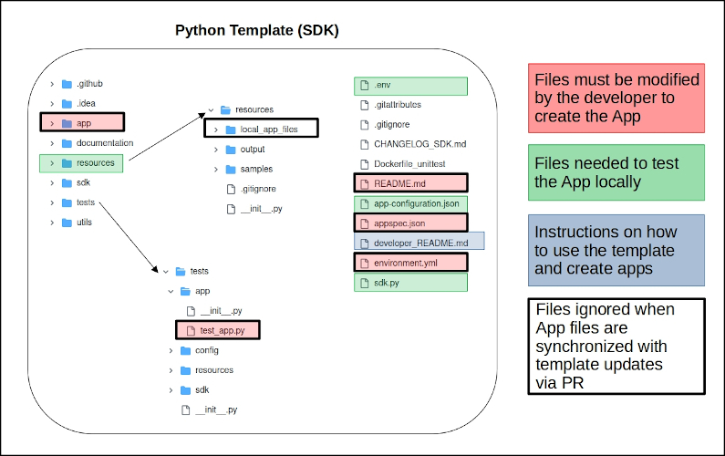
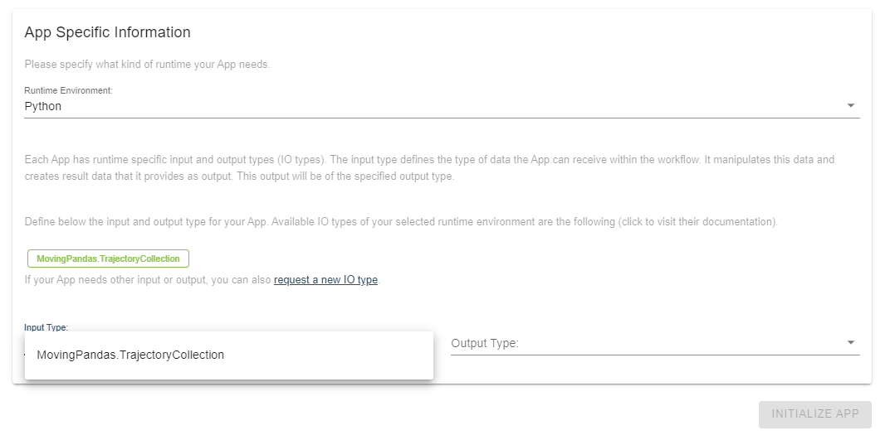
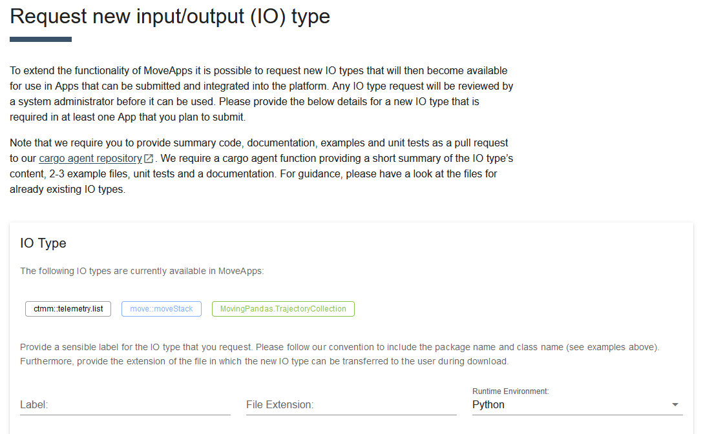
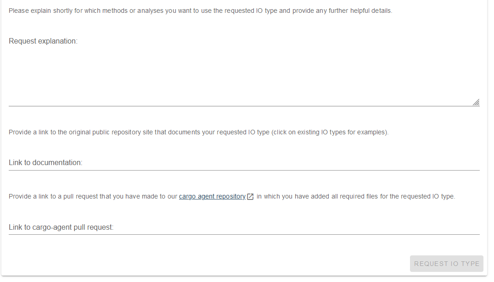

# How to create a Python App

Apps to be submitted must be managed in a public [GitHub](https://github.com) repository. Python Apps must be developed using the [Template Python App](https://github.com/movestore/Template_Python_App) that we ask you to add to your personal GitHub space (login and click `Use this template`). As described in the [develop_README.md](https://github.com/movestore/Template_Python_App/blob/main/developer_README.md), there are some files and folders that you need to adapt to make your App and some that help you emulate locally how your App would run on MoveApps. We recommend using PyCharm or Visual Studio Code (VSC) for local development and Conda for dependency management.

## Steps to create an App
*(details in [MoveApps Python App SDK documentation](python-sdk.md) and below)*

1. **Use the template to initialise an App repository**. Login to GitHub and go to the [Template Python App](https://github.com/movestore/Template_Python_App). Click on `Use this template` to copy the template to a new repository within your GitHub account. Clone this repository to your local system (see [Manage your MoveApps Apps with GitHub and PyCharm](manage_Pyapp_github.md) for instructions on how to do this). Open your Python App project in your local system, e.g. using PyCharm or Conda.

2. **Create the Conda environment** by `conda env create -n APP_NAME --file environment.yml` or by clicking on the top left option in the PyCharm window. When using a terminal, make sure to activate the environment by `conda activate APP_NAME`.

3. **Ensure that our template runs properly on your system**
**Execute `python sdk.py`** or run `sdk.py` interactively to ensure that our template runs properly on your system. Ensure the SDK executes the vanilla template App code (i.e. without alterations and without additional libraries). Everything is set up correctly if no error occurs and you see something like _Welcome to the {'app-name': 'MoveApps Python SDK'}_.

4. **Develop your App code** locally within our template (e.g. in PyCharm) in  the file `./app/app.py`. MoveApps will call your custom App business logic and will instantiate the class `App`. Take a look at the [develop_README.md](https://github.com/movestore/Template_Python_App/blob/main/developer_README.md) for more information. Note that it is possible to add additional `.py` files to `./app/` from which functions can be imported into the main `app.py` file.

5. **Test your App locally** using the file `./sdk.py` which emulates the online MoveApps system. Note that before submission to MoveApps, we also require unit tests to be defined in the `./tests/**` folder. See an example in the template.

3. **Write App specifications** into the file `appspec.json` to define the App's metadata and the user interface for MoveApps users to specify App parameters (see [appspec.json](appspec.md)). Test this file for compliance in the [Settings Editor](https://www.moveapps.org/apps/settingseditor ':ignore'). Note that for Python Apps no dependencies have to be added to this file.

3. **Store/Update environment dependencies** into the file `./environment.yml`.

4. **Write a documentation file** about the detailed function and use of the App, incl. possible error cases. We recommend using [`./README.md`](README_file_description.md) for this.

6. **Create a tag** in your project's GitHub repository by clicking on `Create a new release`.

7. **Initialize the App** on MoveApps (`My Apps > Create new App`). See below for more information.

8. **Submit a first App version** to MoveApps (`Add version`). One of the MoveApps administrators will check the App and build it into a Docker container for integration to the platform. If the App has built successfully, it will acquire private trial status. You will receive an E-mail.

9. **Test a private trial version** of your App on MoveApps. Build a Workflow and test if your App version behaves as expected on the system.

10. **Approve (or retract) your App version** for visibility to all MoveApps users. If it needs adaptions, please retract and submit a new App version.

## Notes and recommendations
- Interactive Python Apps are currently not possible in MoveApps. We are working on sketching out the details and soon a new App type `Python GUI` will become available. Please let us know if you are interested to submit such an App.

- **Stepwise App review is running!** The new trial stage allows you to test your App in MoveApps before it will become available to all users.

- Don’t be afraid to hand in a preliminary App, a warning message can be applied.

- Make sure that users of your App are enabled to understand what is required of input data, what happens in the App and how the method works, so that they can interpret the results correctly and understand possible issues.

## Writing the App
For details about how to write the App, please consult the `developer_README.md` in the template or [here](https://github.com/movestore/Template_Python_App/blob/main/developer_README.md).

## Testing the App
Before submission to MoveApps, all Apps must be thoroughly tested locally using the file `sdk.py`, which behaves (almost) like the online MoveApps system. Please also add some unit tests, similar to those provided in the folder `tests` in the template. 

## Initialization/Creation of the App

Initiate your App on MoveApps by selecting `My Apps > Create new App` from the menu and fill out the form. For the App name please stick to our convention of Title Case without hyphens (e.g. `My New App`). The description should be identical with the short description in your documentation README. You can add a Warning Note that will be highlighted to any MoveApps user adding your App to a Workflow. Note that both Title, Description and Warning note can be edited at any time.

The link to your repository has to end with `.git`; please add it manually if necessary (example: `https://github.com/movestore/MorningReport.git`). 
Each App is defined by an input and output type (IO types) and runtime environment that have to be specified. Possible environmentas are R, R-shiny and Python. 

<kbd>
</kbd>

### Input and Output types
Input and output (IO) types for Python are so far restricted to MovingPandas Trajectory Collections. Those can easily be transformed to geopandas objects. However, IO types can now be extended to any other movement related data types. After selecting Python as your Runtime Environment, check which types are available in the dropdown list. If you need a new IO type for your App, please go to "request a new IO type". Please describe your request to us, link to the documentation of the new IO type and adapt our [cargo agent repository](https://github.com/movestore/cargo-agent-python) accordingly, by creating and linking to a pull request. See the [README](https://github.com/movestore/cargo-agent-python#readme) for details. Once an administrator has approved your IO type request, it will be available on the platform. Make sure to also provide [Translator Apps](translator.md) to/from other IO types to widen the usability of your App on MoveApps. For portability to R and R-shiny Apps also provide code to transfer your data object to one or several csv-files.

Note that repository link, Runtime Environment and IO types will be fixed to the App and cannot be changed afterwards. When you have successfully created the App, it will be listed in the overview `My Apps > App Overview`

## Creation of a new App version
In order to create your first (or any updated new) App version, you must create a `Tag` (via `Release`) of your GitHub repository in its present state. After you have created the `Tag`, go to the MoveApps site and press the `Add Version` button in the detailed view of your App (via `Applications / Your Applications / AppName / Details`). Select the `Tag` from the list of available `Tags` and press `Create Version`. A new App version is only available if your tag creation in GitHub was successful. To submit the new version, you must include a description detailing the changes and select/update a Category that fits your App. If you want to request an additional Category, please suggest it in the interface. After entering all information, click `Save and Submit`.

The App is then checked by a MoveApps administrator for functionality, performant `appspec.json` and possible issues regarding our Terms of Use and the App is built into a Docker container for intergration into the sytem. Upon successful review and built, your App version will enter the `TRIAL` stage and you will receive an E-mail from the system, possibly with comments from the administator. In case your App does not pass the review or the building process was unsuccessful, the administrator will reject your App version and you will get an E-mail with details about it. Please address any raised concerns and submit a new App version then.

## Testing the Trial version of your App

Once your App is in status `TRIAL`, it becomes possible for only you (and the system administrators) to add this App to a Workflow in your MoveApps account. It appears in the list of Apps possible to add to your Workflow (with fitting IO type) in `TRIAL` design (see figure below). Also when included in a Workflow, the App will be highlighted with colour as a `TRIAL` App.

Please, create some Workflow(s) and test if the App version is working as you expect within the platform. Try it for different data sets and parameter settings, use e.g. the wealth of open data sets on Movebank. Take a look at [this compilation of edge case data sets](https://github.com/movestore/Movebank_Example_Datasets) for more intensive testing and development.

If the App is performing well, please select `APPROVE` in the respective App version of the App in your App Overview (`My Apps > App Overview > *your_app_name*`). The App version will aquire the status `APPROVED`and become visible and usable for all registered MoveApps users. In case the App version does not perform as expected, please `RETRACT` it from the system, adapt your code and submit a new version. In the Workflow where the `TRAIL` App has been included, it will be marked as `Retracted` and give an error if executed.

