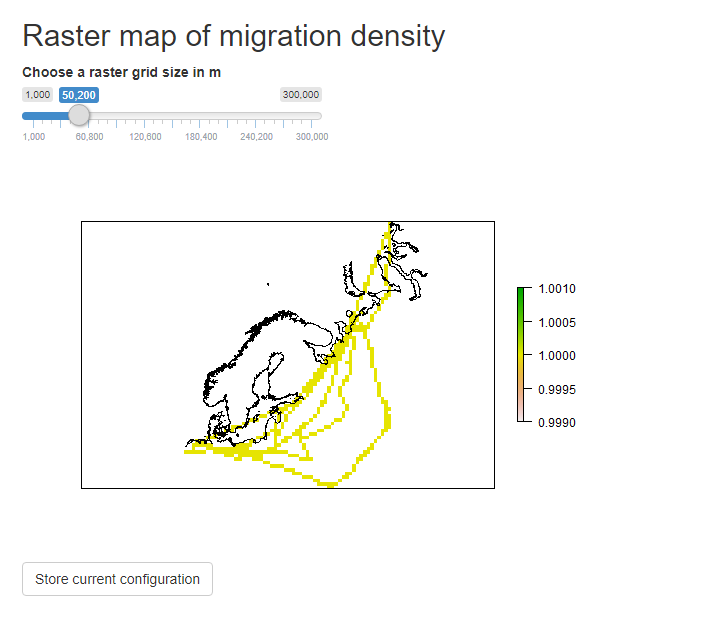

# MoveApps Dokumentation

MoveApps wurde entwickelt um eine Plattform bereitzustellen, die den Austausch und die einfache Nutzung von Programmiercode zur Analyse von Bewegungsdaten ermöglicht.

Programm- und Methodenentwicklern wird die Möglichkeit gegeben ihren Analyse-Code (minimal angepasst) als App ([Wie erstelle ich eine eigene App](de/create_app.md)) zu teilen. Die Apps können dann von Anwendern genutzt werden, die keine Programmierkenntnisse haben. Auf der MoveApps-Plattform können die Anwender kleine Analyse-Apps eigenständig konfigurieren und zu Workflows zusammenfügen ([Wie erstelle ich einen Workflow](de/create_workflow.md)).

Derzeit unterstützen wir R- und R-Shiny-Apps. Diese sollen so bereitgestellt werden, dass Standard-Bewegungsdaten-Sets von Tieren oder anderen sich bewegenden Objekten analysiert werden können. Es ist möglicht Daten aus der [Movebank-Datenbank](http://www.movebank.org) direkt  für die Analyse herunterzuladen und einzubinden.

