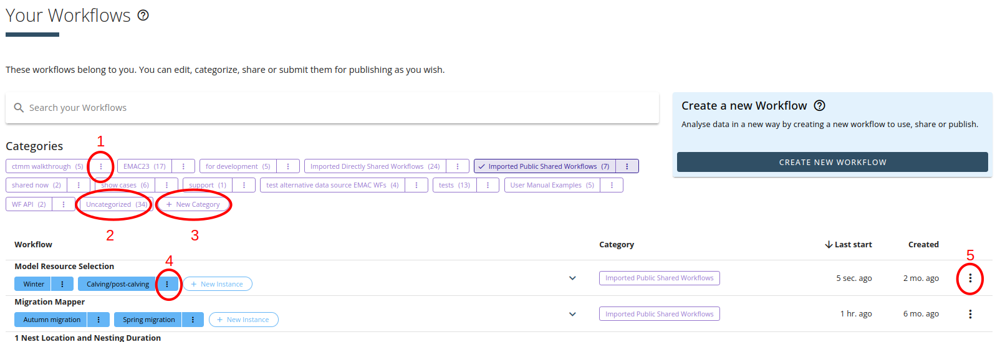

# Wie erstelle ich einen Workflow

Die existierenden Apps können in einem Workflow in Reihe zusammengefügt werden, um sie für eine spezifische Anwendung hintereinander auszuführen.

Jeder Workflow beginnt mit einer App, die die Daten in den Server lädt  (z.B. Movebank oder Dropbox). Die Daten werden dann in passendem Format an die darauffolgenden Apps weitergegeben und analysiert. Jede App benötigt Input-Daten von definiertem Typ (derzeit nur Movement: Positionen mit Zeitpunkt und Individuum) und gibt Output-Daten in definiertem Typ (derzeit nur Movement) weiter bzw. endet mit einem interaktiven UI (RShiny).

Einige Apps produzieren Output-Artefakte, die als Dateien heruntergeladen werden können. Auch Movement-Daten-Output kann runtergeladen werden (in R-Format '.rds').

## Neuen Workflow erstellen
Im Menü Workflows kann ein neuer Workflow unter „Create New Workflow“ erstellt werden. Nach der Vergabe eines Namens für diesen Workflow muss eine „Data Source“ gewählt werden, derzeit entweder Movebank Download oder Download vom persönlichen Cloud-Speicher auf Google Drive oder Dropbox. Bei beiden Apps müssen dann verschiedene Parameter eingestellt werden. Nachdem dies fertiggestellt ist, erscheint die Workflow-Oberfläche mit einer ersten App. Durch drücken auf das "+" hinter dieser ersten App können weitere Download Apps hinzugefügt werden, die ihre Output-Daten dann zum ersten Datensatz hinzugefügt. Somit können verschiedene Datensätze (z.B. aus verschiedenen Movebank-Studies) gemeinsam analysiert werden.

## Workflow zusammenfügen
Durch klicken auf das „+“ können zusätzliche Apps ausgewählt werden, die die runtergeladenen Daten filtern, analysieren oder visualisieren. Es können auch Apps zwischen zwei vorhandene Apps im Workflow eingefügt werden, wenn sie die vom passenden Typ sind (in der Regel input: Movement und output: Movement). Es werden in der Auswahlliste nur solche Apps angezeigt, die vom passenden Typ sind. In der Auswahlliste „Choose an App“ werden die Beschreibungen der Apps angezeigt und zusätzliche Angaben sind durch Klick auf „Details“ einsehbar. Oben rechts kann die Liste auf Suchbegriffe gefiltert werden.

## Workflow laufen lassen
Der fertiggestellte Workflow kann mit „Start Workflow“ gestartet werden. Dadurch werden die Apps nacheinander gestartet und ausgeführt. Dies ist durch die Farbänderung der Punkte in jedem App-Container (rechts unten) zu verfolgen. Der Workflow läuft auch weiter, wenn die Seite moveapps.org verlassen wird, und Ergebnisse können später angeschaut bzw. heruntergeladen werden. Mit „Rerun“ oder „Stop Workflow“ kann der Workflow-Lauf neu gestartet bzw. gestoppt werden. Jeder Workflow, der nur einfache R Apps enthält, kann automatisiert werden und zu einer festgelegten Zeit regelmäßig ausgeführt werden. Diese Option kann im Workflow-Menü neben dem Button „Start Workflow“ gewählt werden. Dort kann der Workflow auch exportiert werden.

## Menüs, Settings und Fehlermeldungen
In jedem App-Modul eines Workflows gibt es neben dem App-Namen ein Menü. Die R-Apps zeigen folgene Menü-Punkte:
	- Settings:  Die Parameter der App können erneut festgelegt und geändert werden
	- Show Download: Die verfügbaren Daten zum Herunterladen (Output, Artefakte, Metadaten, Daten-Zusammenfassung) werden aufgelistet
	- Show Logs: Die Datenprotokolle können eingesehen werden. Bei unerwarteten Ergebnissen oder Fehlermeldungen ist es besonders wichtig diese zu konsultieren!
	- Pin to this app: Die Output der App wird im Workflow fixiert, so dass beim erneuten Ausführen des Workflows nur die hinteren Apps neu ausgeführt werden. Die App, auf der gepint wird und alle vorigen App werden grau unterlegt. Das "Pin" kann jederzeit wieder aufgehoben werden, durch klicken auf "unpin" im unteren Teil der grauen Unterlage.
	- Delete: Löscht die App aus dem Workflow heraus.

## Datenübersicht des App-Output
Jede App, die Daten ausgibt, erstellt eine kurze Zusammenfassung dieser Daten, auf die über den erscheinenden, grünen Knopf an der rechten Seite des App-Containers zugegriffen werden kann. Hier wird die bounding box und der Zeitraum der Positionen gegeben, sowie die Anzahl verschiedener Tiere, die Gesamtzahl der Positionen (Events) und die Anzahl der Positionen für jedes Tier. Schließlich werden noch die Namen aller im Datensatz verfügbaren Variablen aufgelistet. Diese Zusammenfassung kann auch als Datei heruntergeladen werden.

## Shiny R und User Interfaces
Für R-Shiny Apps, die ein User Interface ausgeben, kann dieses nach Ende des Durchlaufs des Workflows über „Open Results“ oder „Shiny UI “ im App-Menu erreicht werden. Dort können Settings direkt variiert werden und interaktiv Daten untersucht werden, abhängig von den Optionen, die der App-Entwickler vorgesehen hat. Es gibt auch R-Shiny Apps, die Daten als Output haben und das User Interface z.B. zum Filtern der Daten nutzen. Auch dann kann darauf über "Shiny UI" im App-Menu zugegriffen werden.

## Workflow-Instanzen
Jeder Workflow kann in mehreren Instanzen ausgeführt und gespeichert werden. D.h. dieselben Apps sind in gleicher Reihenfolge hintereinander geschaltet, nur ihre Settings unterscheiden sich. Es ist wichtig anzumerken, dass die Änderung der App-Zusammensetzung in einer Instanz eines Workflows sich auch auf die anderen Instanzen auswirkt, also dorthin übertragen wird.

Jede zusätzliche Workflow-Instanz muss in der Workflow-Übersicht im gewünschten Workflow über „Start new instance“ angelegt werden. Im dortigen Menü jeder Workflow Instanz kann die Beschreibung angepasst werden (Edit Workflow Instance Details) und die Instanz gelöscht werden. Auch die Beschreibungen kompletter Workflows können in diesem Menü geändert werden, bzw. der Workflow kann gelöscht werden.

