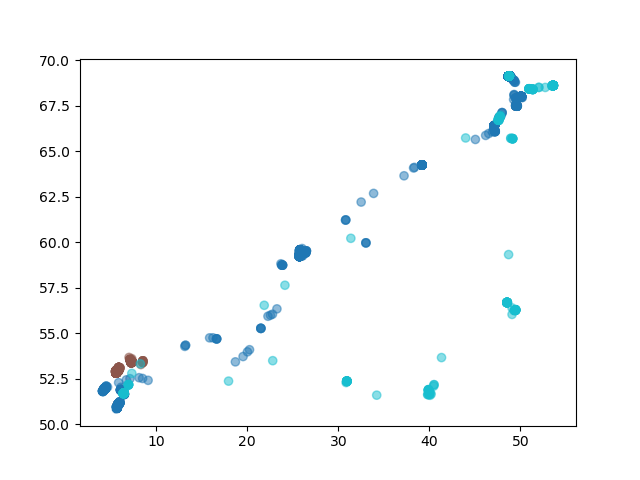

# Hello World! - A Python App Example

Please follow the instructions below and run an example App locally in the Python Software Development Kit (SDK). This is meant to be an example for future Apps that can be submitted to and then run on MoveApps.

## Use SDK template and run the App locally

To get started, please register or login to your [GitHub](https://github.com/) account and go to the GitHub [Template Python App](https://github.com/movestore/Template_Python_App ':ignore'). Press `Use this template` (at the top right) and `Create a new repository` (see [Create a GitHub repository](manage_Pyapp_github.md) for  detailed instructions). Then, open [PyCharm](https://www.jetbrains.com/pycharm/) on your local computer and follow the steps to [Clone your GitHub repository with PyCharm](manage_Pyapp_github.md). To enable the SDK to run on your computer, you need to create a Conda environment (see [step 2: Create the Conda environment](create_py_app.md)).

The included file `./sdk.py` is a local MoveApps substitute that behaves (almost) like the online system. Therefore, this file should not be adapted. The two files emulating MoveApps interactive behaviour locally are `./.env`, which defines the input file path (please only adapt the `SOURCE_FILE` path here), and `./app-configuration.json`, which allows you to adapt the App settings for local testing. Note that the json format is required here. The fourth included file that you must use for development is the `./app/app.py`. This is the file into which all your App code is supposed to go and only the `.py` files in `./app/` will actually be integrated into MoveApps when your App is built.

## Example App code
Here, we give example App code that selects all data points of a given calender year and then saves a plot of the results. Please try it out with the example data set `input4_LatLon.pickle` (see line 1 in `./.env`).

```
*./.env*

SOURCE_FILE=./resources/samples/input4_LatLon.pickle
# development settings
CONFIGURATION_FILE=./app-configuration.json
```

The settings are given in the file `./app-configuration.json` (when using a different input data set make sure that the year is included in the data set). In the MoveApps platform this parameter is provided by an interactive settings window. In the App code, App settings can be accessed from `config`. For example, the value for the setting `year` can be accessed through `config["year"]`.

```
*./app-configuration.json*

{
  "app-name": "MoveApps Python SDK",
  "year": 2014
}
```

The starting point to write the App code is in the file `./app/app.py`. First, we import the necessary MoveApps SDK functions, as well as some other libraries and functions that the App needs to run. After this, the basis of the App is defined.

```
*./app/app.py*

from sdk.moveapps_spec import hook_impl
from sdk.moveapps_io import MoveAppsIo
from movingpandas import TrajectoryCollection
import logging


class App(object):

    def __init__(self, moveapps_io):
        self.moveapps_io = moveapps_io

    @hook_impl
    def execute(self, data: TrajectoryCollection, config: dict) -> TrajectoryCollection:

        logging.info(f'Welcome to the {config}')

        """Your app code goes here"""
		
        # return the resulting data for next Apps in the Workflow
        return result
```

Now, `"""Your app code goes here"""` can be replaced by the custom written App code. In this example, we select all data points of a given calender year and then save a plot of the results. To save the plot, we use the library `matplotlib`, so we need to import it, and we have also defined a function in the file `./app/getGeoDataFrame.py` that we need to import. We also insert our App code into the basis App structure, as well as an example to load an auxiliary file (which we do not use in this example).

```
*./app/app.py*

from sdk.moveapps_spec import hook_impl
from sdk.moveapps_io import MoveAppsIo
from movingpandas import TrajectoryCollection
import logging
import matplotlib.pyplot as plt

# showcase for importing functions from another .py file (in this case from "./app/getGeoDataFrame.py")
from app.getGeoDataFrame import get_GDF


class App(object):

    def __init__(self, moveapps_io):
        self.moveapps_io = moveapps_io

    @hook_impl
    def execute(self, data: TrajectoryCollection, config: dict) -> TrajectoryCollection:

        logging.info(f'Welcome to the {config}')

        """Your app code goes here"""

        # showcase injecting App settings (parameter `year`)
        data_gdf = get_GDF(data)  # translate the TrajectoryCollection to a GeoDataFrame
        logging.info(f'Subsetting data for {config["year"]}')
        # subset the data to only contain the specified year
        if config["year"] in data_gdf.index.year:
            result = data_gdf[data_gdf.index.year == config["year"]]
        else:
            result = None

        # showcase creating an artifact
        if result is not None:
            result.plot(column=data.get_traj_id_col(), alpha=0.5)
            plot_file = self.moveapps_io.create_artifacts_file("plot.png")
            plt.savefig(plot_file)
            logging.info(f'saved plot to {plot_file}')
        else:
            logging.warning("Nothing to plot")

        # showcase accessing auxiliary files
        auxiliary_file_a = MoveAppsIo.get_auxiliary_file_path("auxiliary-file-a")
        with open(auxiliary_file_a, 'r') as f:
            logging.info(f.read())

        # Translate the result back to a TrajectoryCollection
        if result is not None:
            result = TrajectoryCollection(
                result,
                traj_id_col=data.get_traj_id_col(),
                t=data.to_point_gdf().index.name,
                crs=data.get_crs()
            )

        # return the resulting data for next Apps in the Workflow
        return result
```

```
*./app/getGeoDataFrame.py*

# showcase for defining functions in a file other than ./app/app.py 

import logging
from movingpandas import TrajectoryCollection
from geopandas.geodataframe import GeoDataFrame

def get_GDF(data: TrajectoryCollection) -> GeoDataFrame:

    logging.info("Translating to GeoDataFrame")
      
    # Transfer the data to a GeoDataFrame
    data_gdf = data.to_point_gdf()
    
    # Return the data
    return data_gdf
```

Finally, you can run the file `sdk.py`, which is calling supportive code that is emulating MoveApps behaviour as well as the `./app/app.py`. Explore the results that are saved in the folder `./resources/output`. Note that we have provided additional example code in the `./app/app.py` for e.g. the use of auxiliary files as settings. For more details see the file `developer_README.md` in the template or [on Github directly](https://github.com/movestore/Template_Python_App/blob/main/developer_README.md) and the instructions on [writing App code](copilot-python-sdk.md).

There you go with a first running MoveApps App that can select all locations of a given calender year and even returns a plot of those locations. Try adapting the file in `./app/` to your needs and run it locally before submitting to MoveApps.

<kbd></kbd>

## Further steps

Before submission of your first App to the MoveApps platform, you need to thoroughly test your App, add an [appspec.json](appspec.md) file to your GitHub repository and write a [README documentation](README_file_description.md). See our detailed documentation on [how to create an App](create_py_app.md).