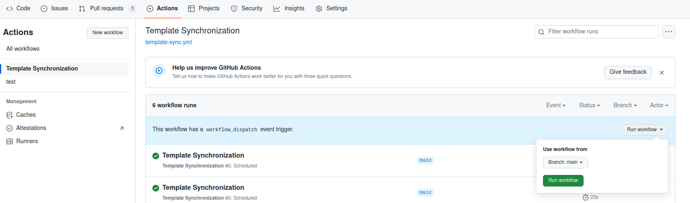

# Manage your MoveApps Apps with GitHub

## Create GitHub repository
Preferably use directly one of our templates ([see details](create_py_app.md)). Click on `Use this template` to copy the template to a new repository within your GitHub account. Specify its name (this can be the name of the App) and provide a short description. In order for our system to access files from your repository it has to be `public`, also for traceability and collaboration in the platform this openness is beneficial. Make sure that you activate to be notified of all activity in the repository (see Watch/Unwatch after creating the repository), so that any issues that users might report about the App will reach you.

<kbd></kbd>

Alternatively, if you have downloaded the files from one of our templates locally, you'll have to create a new repository on your personal GitHub dashboard. Specify its name (this can be the name of the App) and provide a short description. In order for our system to access files from your repository it has to be `public`, also for traceability and collaboration in the platform this openness is beneficial. You can choose a license here, but this will be required of you also later in the process of submitting the App to MoveApps. Make sure that you activate to be notified of all activity in the repository (see Watch/Unwatch after creating the repository), so that any issues that users might report about the App will reach you.

<kbd></kbd>

## Clone your GitHub repository
To comfortably work on your local system, develop your code and test your App locally emulating (almost) the online MoveApps system, you can clone your GitHub repository. 

*(more details coming soon)*

## Keep your repositories up to date (Sync with templates)
To ensure that you can test your App emulating the current MoveApps environment, we have put in place a "*Template Synchronization GH action*". Once a week GitHub checks if there are updates for your App (see in [this image](create_py_app.md) which files are checked/ will be ignored), and makes a pull request (PR). This feature was introduced in October 2023. If you created your App before this date, you can manually add this functionality:

1. Ensure that the Actions permissions are correctly set. In your GitHub repository go to `Settings > Actions > General` and make sure that in the section `Workflow permissions` the options "*Read and write permissions*" is selected and "*Allow GitHub Actions to create and approve pull requests*" is ticked. `Save` your changes.

<kbd></kbd>

2. Manually add the folder `.github` from the [Template Python App](https://github.com/movestore/python-sdk) to your fork.

3. Once these files are added you can manually execute the GH action named *Template Synchronization*.
To do this, in your GitHub repository go to `Actions > Template Synchronization > Run workflow > Run workflow`

<kbd></kbd>

