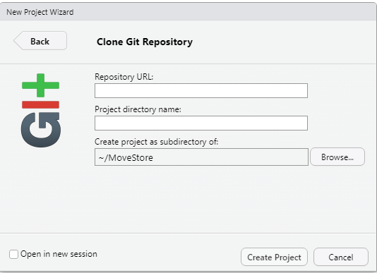
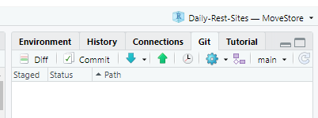
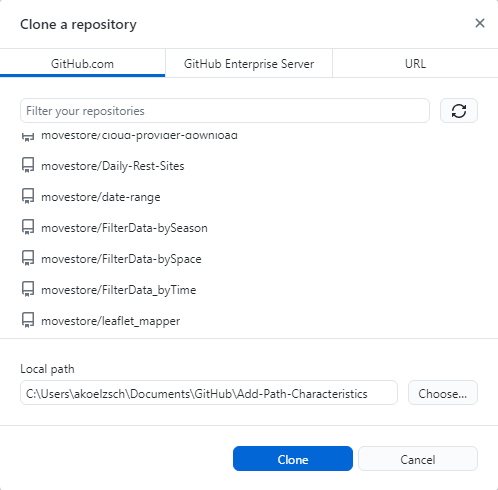
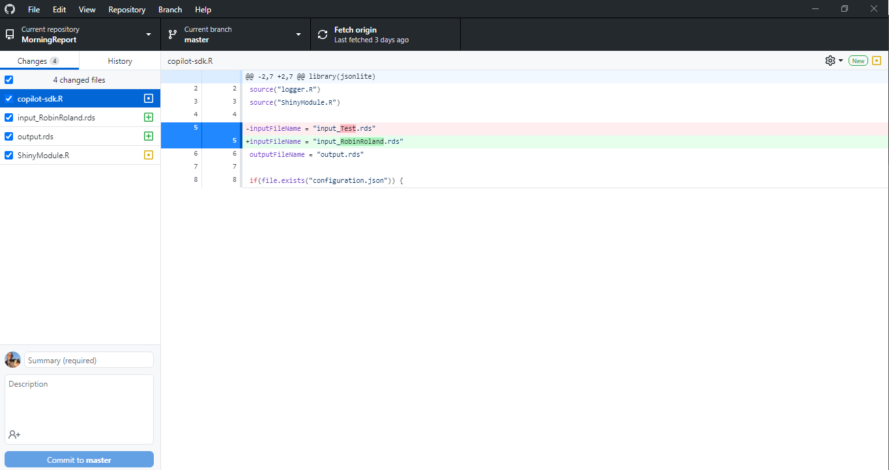
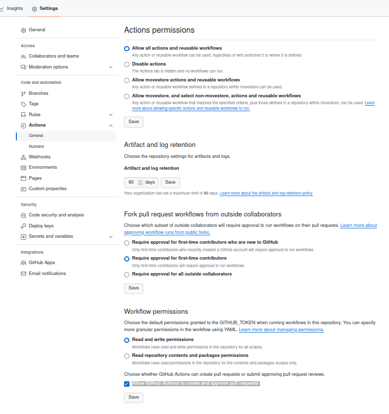
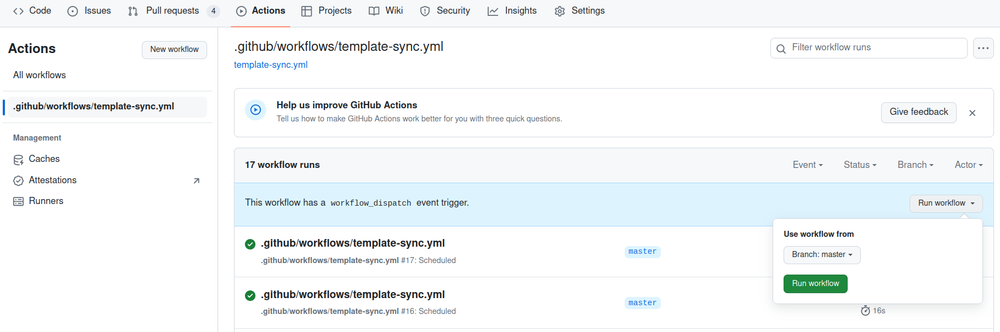

# Manage your MoveApps Apps with GitHub and RStudio

## Create GitHub repository
Preferably use directly one of our templates ([see details](create_app.md)). Click on `Use this template` to copy the template to a new repository within your GitHub account. Specify its name (this can be the name of the App) and provide a short description. In order for our system to access files from your repository it has to be `public`, also for traceability and collaboration in the platform this openness is beneficial. Make sure that you activate to be notified of all activity in the repository (see Watch/Unwatch after creating the repository), so that any issues that users might report about the App will reach you.

<kbd></kbd>

Alternatively, if you have downloaded the files from one of our templates locally, you'll have to create a new repository on your personal GitHub dashboard. Specify its name (this can be the name of the App) and provide a short description. In order for our system to access files from your repository it has to be `public`, also for traceability and collaboration in the platform this openness is beneficial. You can choose a license here, but this will be required of you also later in the process of submitting the App to MoveApps. Make sure that you activate to be notified of all activity in the repository (see Watch/Unwatch after creating the repository), so that any issues that users might report about the App will reach you.

<kbd></kbd>

## Clone your GitHub repository
To comfortably work on your local system, develop your code and test your App locally emulating (almost) the online MoveApps system, you can clone your GitHub repository. This can be done directly in RStudio or by using GitHub Desktop.

### with RStudio
Open RStudio and Create a new Project from Git Version Control: `File > New Project > Version Control > Git`. Then enter the URL of your GitHub repository (`Code > Local > HTTPS` in GitHub) and select your local project directory name. That's it, you can now use RStudio to develop and test your code locally and push and pull updates to your project via the top right window `Git` which indicates files that have changed and can be pushed and pulled from/to your GitHub respository. Note that before such updates, it is required to commit your changes with a small description of the changes.

<kbd></kbd>
<kbd></kbd>

### with GitHub Desktop
Another way to work on your local system is by using the GitHub Desktop, which is a software programme often used for Version Control with Git and GitHub. It requires the installation of that programme. Once you have opened GitHub Desktop you can clone a GitHub repository under `File > Clone repository`, where you can select your repositories (once your account is connected) and clone them to local folders. New files will then be highlighted to be pushed and pulled whenever you open GitHub Desktop. Also here commits and descriptions thereof are required, very comfortably in a small window below the list of changed files.

<kbd></kbd>
<kbd></kbd>

## Keep your repositories up to date (Sync with templates)
To ensure that you can test your App emulating the current MoveApps environment, we have put in place a "*Template Synchronization GH action*". Once a week GitHub checks if there are updates for your App (see in [this image](create_app.md#how-to-create-an-r-or-rshiny-app) which files are checked/ will be ignored), and makes a pull request (PR).

!\> Do not use this option if your App is still written for input data of class `move`!! 

Ensure that the Actions permissions are correctly set. In your GitHub repository go to `Settings > Actions > General` and make sure that in the section `Workflow permissions` the options "*Read and write permissions*" is selected and "*Allow GitHub Actions to create and approve pull requests*" is ticked. `Save` your changes.

<kbd></kbd>

This feature was introduced in June 2023. If you created your App before this date, you can manually add this functionality:
1. Ensure that the Actions permissions are correctly set (see above).

2. Manually add the folder `.github` from the corresponding template to your fork. ([Template R Function App](https://github.com/movestore/Template_R_Function_App ':ignore'), [Template R Shiny App](https://github.com/movestore/Template_R_Shiny_App ':ignore') or [Template R Shinydashboard App](https://github.com/movestore/Template_R_Shinydashboard_App ':ignore'))

3. Once these files are added you can manually execute the GH action named *.github/workflows/template-sync.yml*.
To do this, in your GitHub repository go to `Actions > .github/workflows/template-sync.yml > Run workflow > Run workflow`.
You only have to do this once. Thereafter the synchronization will happen automatically. 

<kbd></kbd>

4. If you are using the `Template R Function App`, after merging the generated pull request, add the file `app-configuration.json` manually to the root directory of your App.

