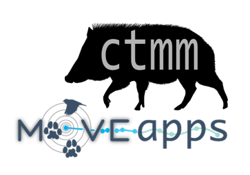

# Short-term code development position: Bring ctmm to MoveApps

We are looking for an experienced R-programmer that can [develop a sequence of Apps for MoveApps](Ctmm_to_MoveApps_-_Job_Advert.pdf) using the <code>ctmm</code> (continuous-time movement modeling) R package. The assignment can be started anytime and must be finalized by 12 June 2023. The Apps have to be set up in collaboration with the MoveApps development team and under advice by the ctmm package developers.

Payment is $15,000 USD paid half at the midway point and half at the successful end of the project. Work can be performed remotely or in collaboration with one of the institutes of the ctmm team or one of the institutes of the MoveApps team. [Contact us](mailto:info@moveapps.org)!