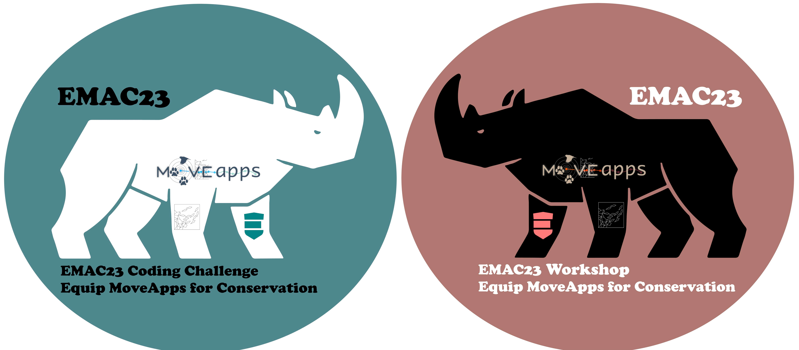

# EMAC23 Coding Challenge — Closed

Motivated by having been named a [Conservation Tech Award grantee in 2022](https://www.earthranger.com/news/conservation-tech-award-2022),we recently held the EMAC23 coding challenge to Equip MoveApps for Conservation.

Working on [five use cases](EMAC23_CodingChallenge_Details3.pdf) many <code>R</code> and <code>Python</code> developers have submitted Apps. We are very grateful for each contribution, working with you is a great experience!<

All contributions are now being evaluated and the developers of the 10 best Apps will be invited to join the EMAC23 workshop at the [Max-Planck Institute of Animal Behavior](https://www.ab.mpg.de/) in Germany, fully paid by our funds (provided by [AI2’s EarthRanger](https://www.earthranger.com/) and the [Centre for the Advanced Study of Collective Behaviour](https://www.exc.uni-konstanz.de/collective-behaviour/)). We look forward to meeting you!