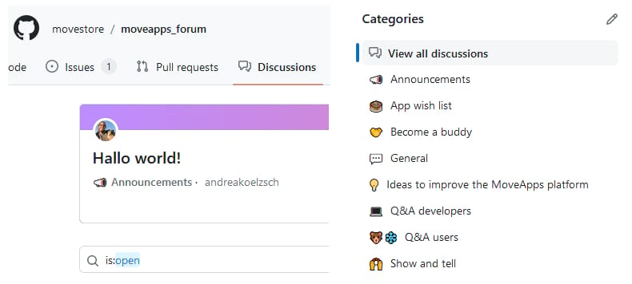

# MoveApps Forum for you to exchange and give feedback

MoveApps has initiated a [GitHub Discussion Forum](https://github.com/movestore/moveapps_forum/discussions) for any user or App developer to (i) give us feedback in a findable manner and (ii) connect with each other. 

Use it to post your ecological use cases as App developers need details to start digging into the code. Use it to discuss new methods or App ideas that you have set up and want to have feedback on. Become buddies. Tell us about your latest achievement on MoveApps or join interacting with the community in any other way!

We sincerely hope that this Forum will become more and more used, helpful for all and increase community interaction. Let's get together!
