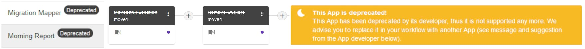

# App Deprecation

By updating Apps to new functionality, many old Apps have recently been [deprecated](https://docs.moveapps.org/#/app_deprecation). For quick recognition, the titles of deprecated Apps appear stroke through in any appearance on the platform (existing Workflows, public Workflows, App browser). However, they are still fully functional. See the App details of deprecated Apps in your Workflow for the Deprecation message, which includes a message from the App developer and a suggested replacement. Note that deprecated Apps cannot be added to any new Workflows.

[Public workflows](https://docs.moveapps.org/#/share_workflow?id=how-to-find-and-add-public-workflows) that contain at least one deprecated App are marked as `deprecated` in the list. However, they are still functional and can be copied/added to your Dashboard and executed, to retain reproducibility of Workflow use. Most deprecated Apps will still be running as expected, but if they interact with outside ressources (e.g. Movebank), functionality cannot be guaranteed.

For new, independent analyses we strongly recommend to replace the deprecated Apps in your Workflow. Note that such replacement might require usage of [translator Apps](translator.md). Optimally, one would build a new workflow from scratch, as deprecated Apps cannot be added then.

