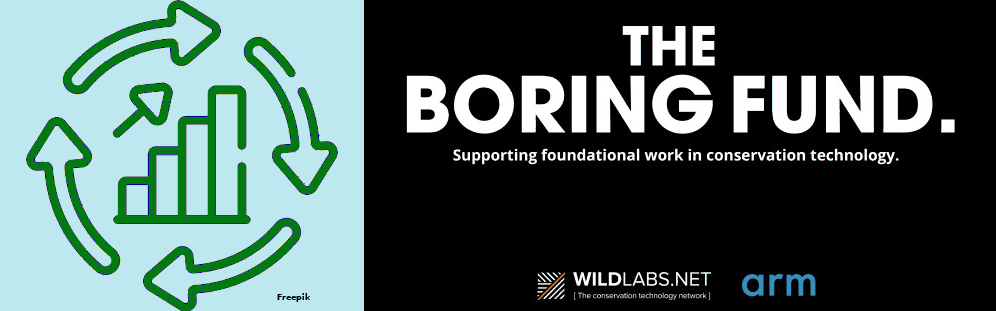

# Support with errors and links to user manual

We have implemented the last improvements made possible thanks to ["The Boring Fund"](https://wildlabs.net/article/meet-winners-boring-fund-2024) that MoveApps was awarded with recently. We have stated to populate the website with links to the user manual to make it easier to find the help for specific topics. We have also improved the communication of errors by enabling the download the logs of App. Find more details in our [latest newsletter](NewsletterMay25.pdf).