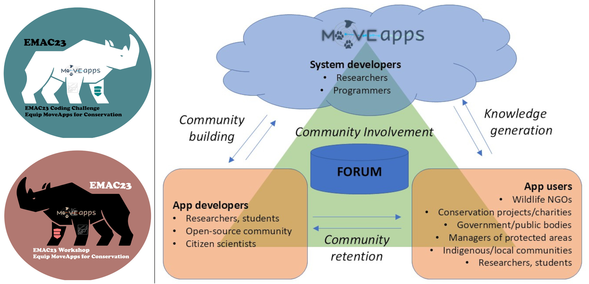

# Our paper about volunteer coders as citizen scientists is out!

In 2023 we held the EMAC23 coding challenge and follow up workshop. During the workshop we decided to write up a paper all together to share the experience and the lessons learned in engaging citizen scientists as volunteer code developers. We are pleased to share with you the paper that just has been published: ["Citizen scientists for MoveApps: Innovations and insights from volunteer coders in wildlife conservation"](Koelzsch_2025_MethodsEcolEvol.pdf)

A huge thank you to Margaux, Chloe, Matthias, Bo, Christoph, Vee, Matt, Jed, Alex, Lauren, Tomé and Arky for participating in the challenge and making this a very fun and enriching experience!!
