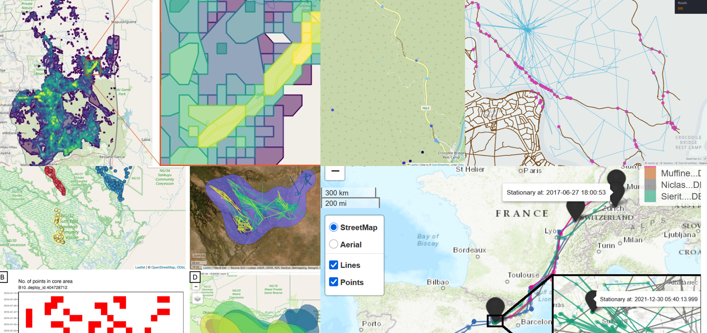

# Blog post about MoveApps

Following the paper that recently got published about volunteer coders as citizen scientists, Andrea got invited to write a blog post for the official blog of the Journal Methods in Ecology and Evolution. Read all about it here: [Citizen scientist coders for wildlife conservation – a MoveApps story](https://methodsblog.com/2025/08/28/citizen-scientist-coders-for-wildlife-conservation-a-moveapps-story/)
