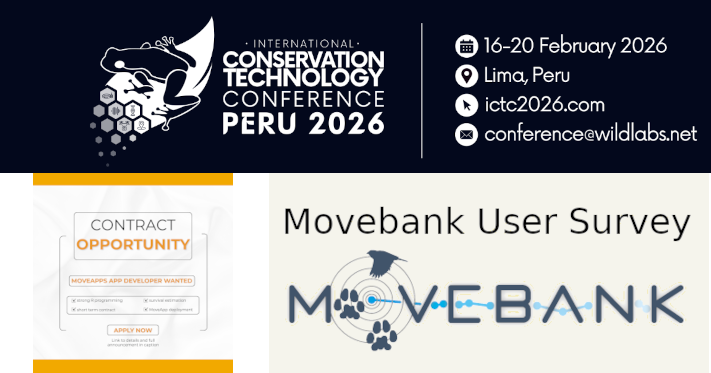

# Announcements

We are excited to share that the registration is now open for our workshop *"User-friendly tools for conservation: Automated no-code analyses of animal tracking data using Movebank and MoveApps"* at the International Conservation Technology Conference (ICTC). Find all details on the [ICTC webpage](https://whova.com/web/YBLOiSDZJ2t10k0fMnzvppJh%40t0sBJVXlWRFu5Kc4WY%3D/Pre-Conference%20Workshops/).

**Please help us improve Movebank by participating in this survey**. It will just take you about 15 mins to fill out, your feedback will be highly appreciated: https://survey.academiccloud.de/f/221856?lang=en. A big thank you to all that already have participated.

**Contract Opportunity:** Collaborators of ours from the [Yukon2Yellowstone project](Y2Y.net) are looking for someone for a contract job to implementing established survival analysis methods in R and packaging them as MoveApps Apps. **Application deadline January 21, 2026!**. [See details here](Contract Opportunity.pdf)

Find more details in our [latest newsletter](NewsletterJan26.pdf).