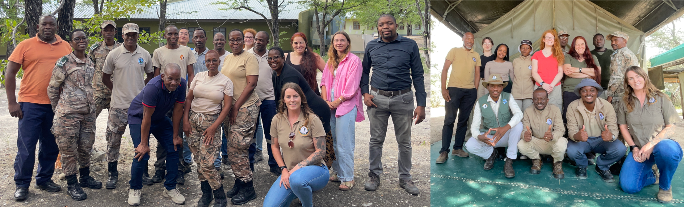

# Workshops in Botswana

During the last weeks we held a one day workshop at the [Botswana Wildlife Training Institute](https://en.wikipedia.org/wiki/Botswana_Wildlife_Training_Institute) in Maun, Botswana, and a three day workshop at the research camp of the [Leopard Ecology and Conservation (LEC)](https://www.leopard.ch) at the Khutse Game Reserve, Botswana. Thank you very much for inviting us, it was a great pleasure to work with you.