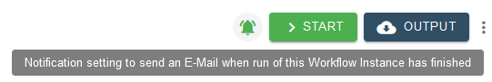
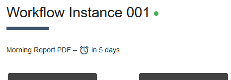
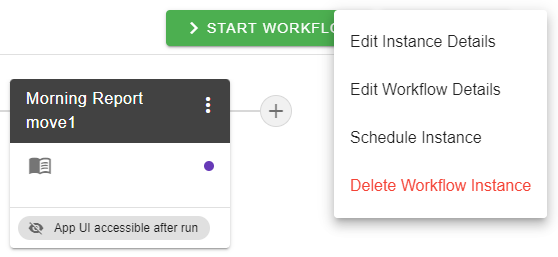
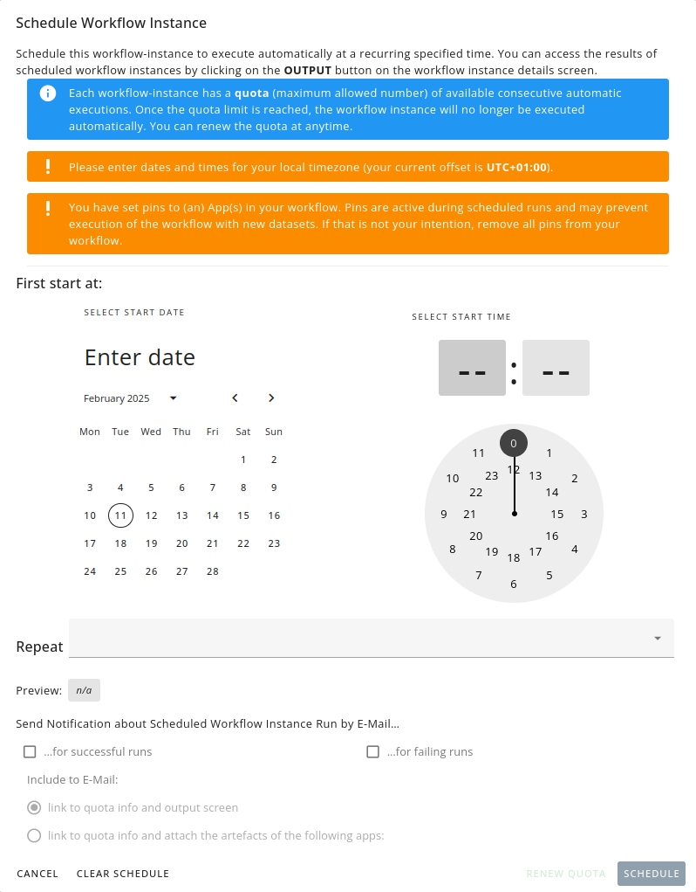
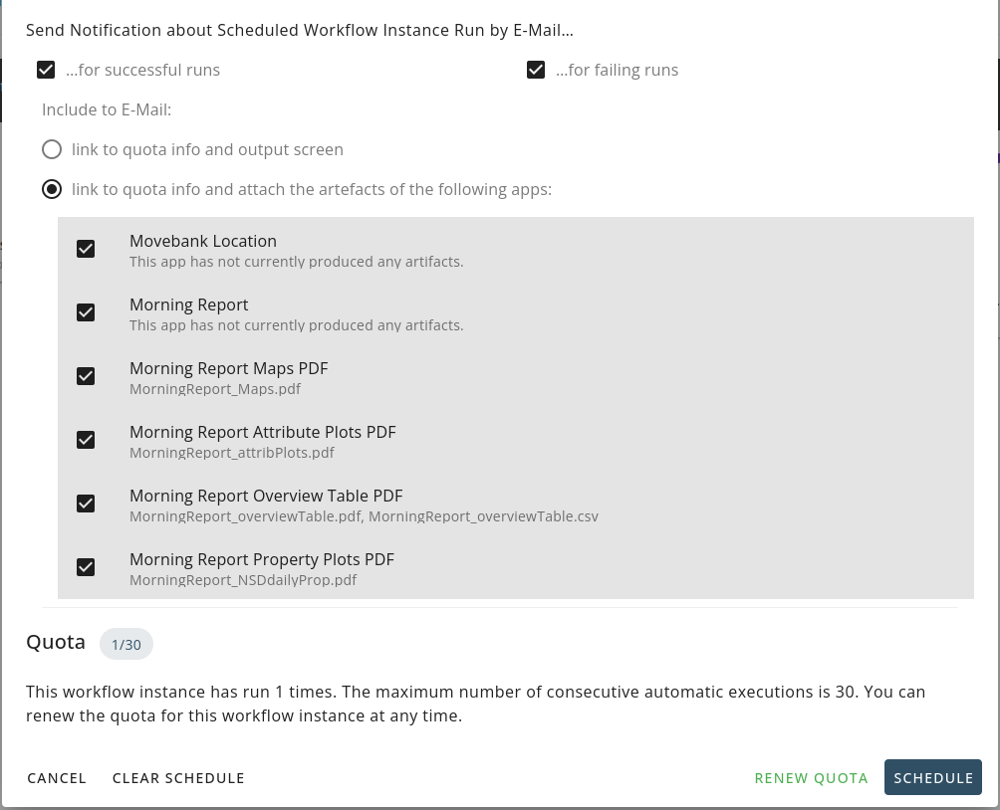

# E-mail Notification and Scheduled Workflow Runs

For each Workflow instance, E-mail notifications and scheduled runs can be set up. E-mail-notifications can be requested simply to be informed when a more complex or memory intensive workflow instance that takes longer, has completed.  Scheduled runs are useful when regular updates of analysis outputs are required.

## Notification of Completion

By activating the 'Notification' icon next to the Start button, it is possible to request a completion message to automatically be sent to the user's E-mail address. Green colour of the icon idicates that this feature is active. In the Workflow Instance Menu, an additional checkbox is available for selecting this feature. The received E-mail contains links to the Workflow instance and outputs.

<kbd></kbd>

## Scheduled Workflow Runs

Each Workflow Instance can be scheduled to run regularly in an automatic mode at a fixed time interval. MoveApps currently supports daily, weekly and monthly intervals. Results (products) of the scheduled runs can be accessed in the Workflow's `Output` overview, can be sent as E-mail attachments or can be accessed via secure Application Programming Interfaces (APIs), providing https links. In the description field of your Workflow Instance view an indication of the time of the next scheduled run is provided.

<kbd></kbd>

### How to Schedule Workflow Runs

In the Workflow drop-down menu (next to the `Output` button) you can select `Schedule Instance`. This opens a window where you can adjust the settings of the scheduling. You must select the date and time your Workflow Instance should run for the first time. Note that the times need to be provided in your local time zone, which is indicated in the yellow panel. You also need to select how often the Workflow should run, the current options are daily, weekly and monthly. Once these are selected, you can see a preview of the next scheduled runs.
To prevent having scheduled Workflows running forever in case they are forgotten, each Scheduled Instance is allowed to run up to 30 (if daily) or 12 (if weekly or monthly) times before the user has to return to MoveApps and renew the quota. The already used times are indicated in the lower panel.

!> Note that pins to your Workflow Instance are affecting the scheduled runs. So, if you want an automated new data download, unpin any Apps in your Workflow.

<kbd></kbd>

<kbd></kbd>

### Requesting E-mails with Links and Attachments in Scheduled Workflow Runs
It is possible to have an E-mail sent to the user's E-mail address after each of the automated Workflow runs. It is possible to select receiving an email when the Workflow Instance run successfully and/or when the run failed.
The emails received for the successful runs have two options: (1) the email contains a link to the output window of the Workflow Instance and links to the User Interface ("OPEN APP UI") if Apps with this option are contained in the Workflow; (2) the email contains, additionally to these links, also the Artifacts of the Apps as an attachment. Which Artifacts should be attached can be selected.

!\> If the data and/or results are very sensitive, please deselect the products overview screen.

<kbd></kbd>

Note that there is an App that has been developed to modify the E-mail message of the scheduled runs based on results from the Workflow: the ["Email Alert"](https://www.moveapps.org/apps/browser/362b42c7-d7a2-4fa6-8d08-b3ddae002f9e) App. It creates a text file called `email_alert_text.txt` that will be automatically added to the text of the E-mail message. It allows, e.g. an alert message to be sent if a certain condition is fulfilled in the analysed data set.
