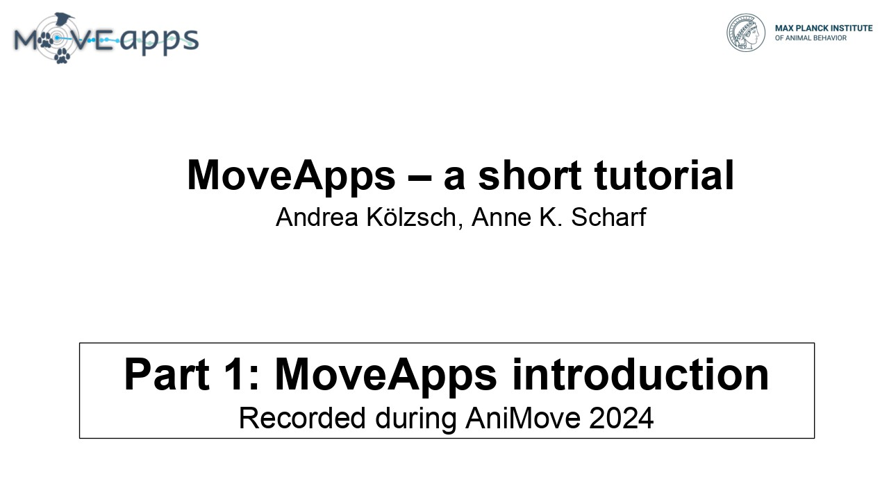
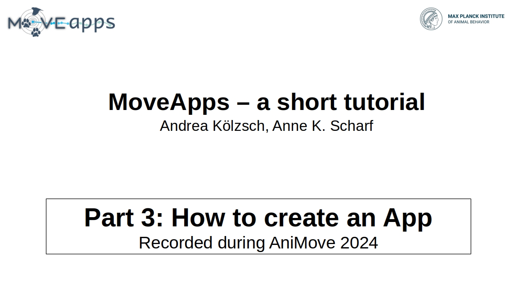
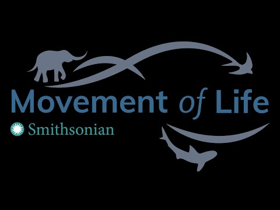
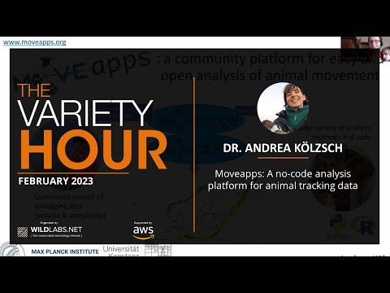

## Tutorials

<table>
  <tr>
    <td>
      
    </td>
    <td>
      
    </td>
  <td>
    
    </td>
</table>

### Additional videos about MoveApps

<table class>
  <tr>
    <td>
      
    </td>
    <td>
      
    </td>
</table>